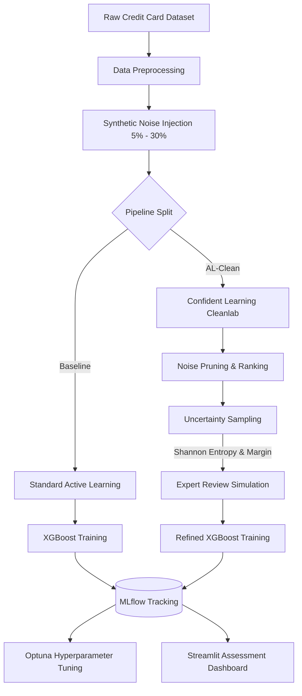

# AL-Clean: Uncertainty-Aware Active Learning for Cost-Efficient Data Labeling


## 📖 Abstract
Active learning (AL) is a powerful paradigm for reducing data annotation costs by strategically selecting the most informative samples for a model to learn from. However, in real-world scenarios, human annotators are fallible and labeling noise is inevitable. Standard active learning algorithms implicitly trust these noisy oracles, and their uncertainty sampling algorithms inadvertently prioritize the exact ambiguous examples most likely to be mislabeled. Consequently, the active learning loop actively poisons its own training set.

**AL-Clean** introduces a robust, cost-efficient framework that integrates Confident Learning (via the Cleanlab library) directly into the active learning acquisition loop. By automatically auditing the chosen high-uncertainty samples and filtering out label errors before they enter the training pool, AL-Clean ensures model convergence and maintains data-efficiency even in highly corrupted environments.

---

## 🏗️ System Architecture
AL-Clean has been architected as a modern full-stack data science platform with distinct Backend and Frontend environments.



### 🐍 Backend (MLOps Engine)
The backend powers the heavy computational ML pipeline, tracking, and statistical benchmarking.
- **FastAPI Bridge**: A synchronous execution endpoint (`/run-pipeline`) that allows dynamic triggering of the ML pipeline directly from the UI.
- **Data Loaders**: Dynamically loads real-world datasets (e.g., Kaggle Credit Card Fraud) and injects controlled label noise.
- **Active Learner**: Selects the top $N$ uncertain samples dynamically using either Shannon Entropy ($-\sum p \log p$) or Margin-based uncertainty metrics.
- **Cleanlab Filter**: Computes the joint distribution of noisy and true labels to prune corrupted samples in real-time.
- **MLflow Integration**: Every execution runs within a tracked MLflow context, logging hyperparameter configurations, metrics (PR-AUC, MCC, F1 Score), and exporting Markdown tables.
- **Optuna Optimization**: Executes dynamic XGBoost hyperparameter trials on the initial seed dataset.

### 📊 Frontend (Streamlit Dashboard)
An interactive assessment dashboard built to visually present pipeline results dynamically.
- **Stack**: Streamlit + Pandas
- **Visualization**: Renders line charts and data tables tracking model performance metrics (like PR-AUC) over multiple active learning iterations.

---

## 📂 Directory Structure

```text
AL-CLEAN/
├── backend/                  # MLOps & Python Engine
│   ├── src/                  
│   │   ├── data_loader.py    # Loads Kaggle dataset & injects corruption
│   │   ├── active_learner.py # Optuna tuning & uncertainty sampling
│   │   ├── cleaner.py        # Cleanlab Confident Learning wrapper
│   │   └── evaluator.py      # Evaluation loops & statistical validation
│   ├── api.py                # FastAPI execution bridge
│   ├── main.py               # MLflow benchmark execution entry point
│   ├── al_clean_pipeline.py  # Standalone pipeline script
│   └── requirements.txt      # Python dependencies
│
├── frontend/                 # Interactive Dashboard
│   └── app.py                # Core Streamlit dashboard UI
│
├── .gitignore                
├── Implementation_Audit_Report.md
└── README.md                 
```

---

## 🚀 Setup Instructions

### 1. Running the Backend Engine (MLflow & FastAPI)
The backend requires Python and standard data science dependencies.

```bash
# Start the MLflow tracking server locally
python -m mlflow ui --port 5000

# In a new terminal, navigate to the backend directory
cd backend

# Install dependencies
pip install -r requirements.txt

# Start the FastAPI backend
python -m uvicorn api:app --host 0.0.0.0 --port 8000 --reload
```

### 2. Running the Streamlit Dashboard

```bash
# In a new terminal, navigate to the root directory
# Install streamlit and pandas if not already installed
pip install streamlit pandas requests

# Start the Streamlit server
python -m streamlit run frontend/app.py --server.port 8501
```
Open `http://localhost:8501` in your browser to view the interactive AL-Clean dashboard. The dashboard will automatically fetch your latest MLflow metrics!

---

## 📈 Evaluation Metrics
The pipeline tracks the following performance metrics dynamically across iterations:
- **PR-AUC**: Precision-Recall Area Under the Curve (ideal for imbalanced data)
- **MCC**: Matthews Correlation Coefficient (balanced measure for binary classification)
- **F1 Score**: Harmonic mean of precision and recall
These metrics are natively tracked via MLflow and visualized via the Streamlit dashboard.

---
*Built for robustness. Designed for scale. Protected against noise.*
